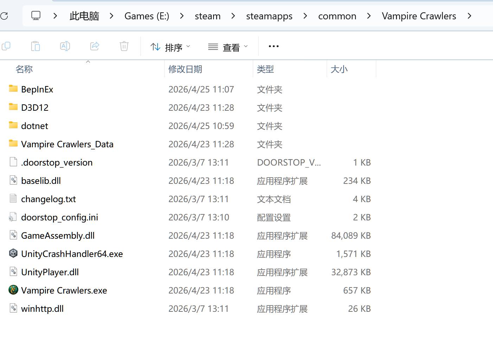

# 吸血鬼爬行者 Mod 合集

这是一个为游戏《吸血鬼爬行者》(Vampire Crawlers) 制作的 BepInEx IL2CPP Mod 合集仓库。  
当前包含 2 个实用 Mod：敌人总血量显示 + 手牌滚轮排序。

## Mod 一览

### 敌人总血量显示 Mod

- 在战斗界面顶部显示所有敌人的总血量与百分比。
- 血条扣除带平滑动画，观感更自然。
- 受击后有短暂延迟再缩减，打击反馈更好。
- 采用 Harmony 补丁，避免每帧场景搜索，性能更稳。

### 手牌滚轮排序 Mod

- 触发方式：滚动鼠标滚轮。
- 排序方向：下滑升序，上滑降序。
- 防误触：按下 `Esc`、暂停界面或设置面板打开时不触发。
- 防抖节流：滚轮触发有冷却，避免大幅滚动导致高频重复排序。
- 规则补充：`free` 牌按牌面值参与排序。

## 🛠️ 安装方法

> 请先自行安装指定版本：`BepInEx-Unity.IL2CPP-*-6.0.0-be.755+3fab71a`。

1. 先安装 BepInEx（按你的系统下载并解压到游戏根目录）：
   - Windows x64：  
     [BepInEx-Unity.IL2CPP-win-x64-6.0.0-be.755+3fab71a.zip](https://builds.bepinex.dev/projects/bepinex_be/755/BepInEx-Unity.IL2CPP-win-x64-6.0.0-be.755%2B3fab71a.zip)
   - macOS x64：  
     [BepInEx-Unity.IL2CPP-macos-x64-6.0.0-be.755+3fab71a.zip](https://builds.bepinex.dev/projects/bepinex_be/755/BepInEx-Unity.IL2CPP-macos-x64-6.0.0-be.755%2B3fab71a.zip)
   - 其他平台/版本总览：  
     [BepInEx Bleeding Edge 下载总站](https://builds.bepinex.dev/projects/bepinex_be)
2. 将本仓库 `plugins/` 目录下的 `*.dll` 复制到游戏目录的 `BepInEx/plugins/` 中。
3. 启动游戏进入战斗即可生效。

*安装参考：将文件放入上图所示的游戏根目录*

## 📂 项目结构

- `plugins/`：已编译的 Mod 插件（`ShowEnemyHpMod.dll`、`SortCardMod.dll`）。
- `源码/`：Mod C# 源码（`ShowEnemyHpMod.cs`、`SortCardMod.cs`）。
- `img1.gif`：敌人总血量显示 Mod 演示图。
- `img2.gif`：手牌滚轮排序 Mod 演示图。

## 👨‍💻 开发说明

- 项目面向 **Unity 6 (6000.x) + IL2CPP** 环境。
- 通过 Harmony 补丁和反射适配部分游戏内部类型，减少版本差异影响。
- 手牌排序 Mod 重点处理了 UI 与模型层同步，以及输入场景屏蔽（暂停/设置/ESC）问题。

## ❓ 常见问题 (Q&A)

**Q: 使用这些 Mod 会影响 Steam 成就吗？**  
A: 当前合集内 Mod 主要是 UI/交互增强，不涉及成就或存档校验逻辑，通常不会影响成就。

**Q: Steam Deck 可以使用吗？**  
A: 尚未完整实机测试。理论上 Proton 环境可正常加载 BepInEx IL2CPP 时即可运行，欢迎反馈兼容性结果。

